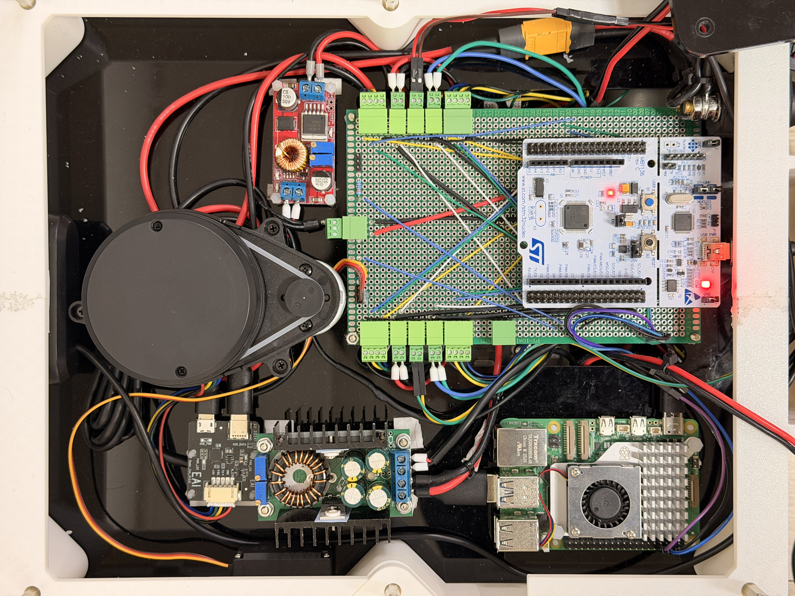

## 🔌 Pin Configuration
STM32CubeMX를 통해 설정된 핀맵과 이를 물리적으로 연결한 실제 모습입니다.
직접 납땜하여 제작한 **Custom Expansion Shield**를 통해 배선 복잡도를 줄이고 유지보수성을 높였습니다.

* **STM32F446RE (Center):** 메인 제어 유닛
* **Custom Protoboard Shield:** 모터/센서 커넥터 및 배선 통합
* **Raspberry Pi 5 (Left):** 상위 제어 및 ROS2 통신
