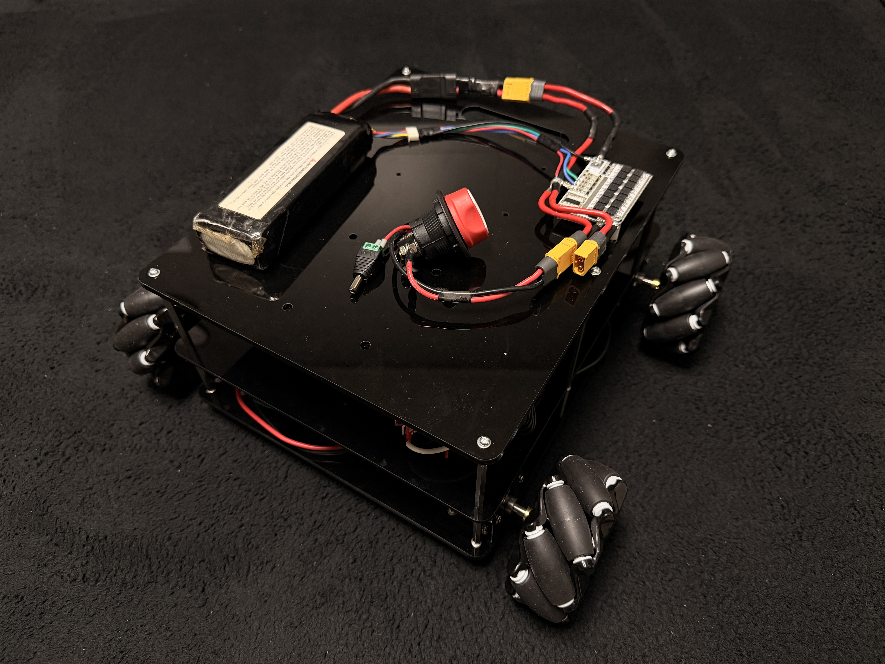
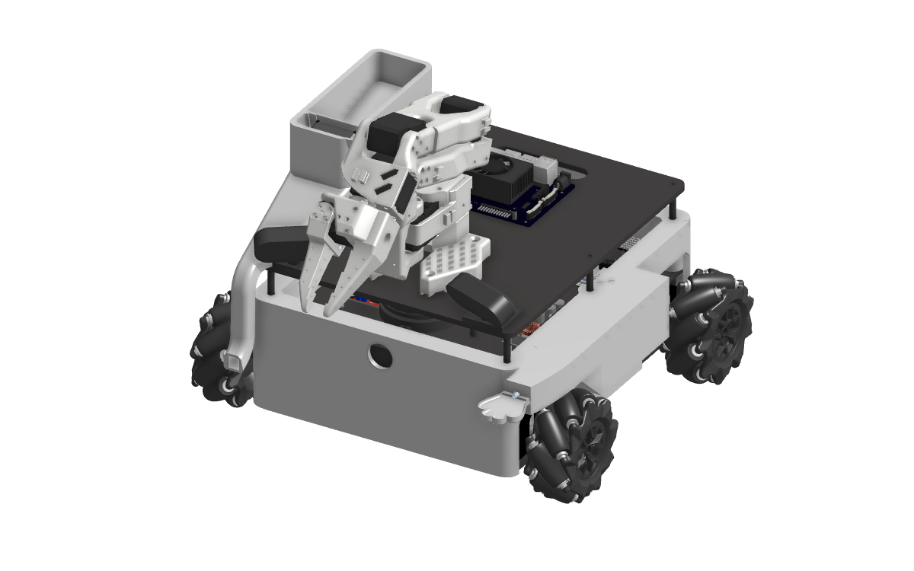

# 🤖 PET-Ner Project: Hardware Integration & Power System

PET-Ner는 안정적인 구동과 효율적인 공간 활용을 위해 설계된 3단 적층형 전원 시스템 및 STM32 제어 보드를 탑재한 4WD 메카넘 휠 로봇입니다.

## 📂 Documentation
1. [🛠️ 하드웨어 부품 명세서 (BOM)](./BOM.md)
2. [📌 핀 매핑 및 회로 연결도 (Pin Mapping)](./PinMapping.md)
3. [⚡ 전원 시스템 아키텍처 (Power Architecture)](./PowerArchitecture.md)

---

## 🏗️ 하드웨어 적층 구조 (3-Tier Structure)

PET-Ner는 기능별로 3개의 층을 분리하여 설계되었습니다.

* **Tier 1 (Base Layer): 구동 및 관성 센싱**
    * 메카넘 휠 및 JGB37-520 모터 4개
    * MDD10A 모터 드라이버 (2ch) 2개
    * BNO085 IMU 센서 (1단 천장에 부착)
* **Tier 2 (Logic Layer): 메인 제어 및 전원 변환**
    * STM32 Nucleo-F401RE 제어 보드
    * LDS-01 LiDAR 센서
    * 전원 컨버터 모듈 (XL4016, XL4015, LTC3780)
* **Tier 3 (AI & Power Layer): 지능 제어 및 에너지원**
    * Jetson Orin Nano (AI 추론)
    * 로봇팔 (So Arm 101) 및 사료 급식통
    * LiPo 3S 배터리 및 BMS 모듈

---

## ✅ 하드웨어 검증 완료
* **배선 보강:** GND 라인 솔더링 레이어링 완료 [후면 배선 보기](./images/hardware/hardware_wiring_back.jpg)
* **전압 분배:** 배터리 모니터링 회로(10k:3.3k) 검증 완료 [검증 샷 보기](./images/hardware/voltage_divider_test.jpg)

## 🦾 Mechanical Design

본 프로젝트의 하드웨어는 클라우드 기반 CAD인 **Onshape**를 사용하여 설계되었습니다.
모든 부품은 3D 프린팅(PLA) 및 레이저 커팅에 최적화되도록 DFM(Design for Manufacturing)을 고려하여 제작되었습니다.

### 📸 Assembly & Implementation
설계된 모델을 바탕으로 실제 조립된 제어부(Control Layer)의 모습입니다.

* **Design Tool:** Onshape (Cloud CAD)
* **Fabrication:** 3D Printing (Ender-3, PLA), Laser Cutting (Acryl 3T)
* **Key Features:**
    * STM32 & RPi 5 적층 구조 설계 (Space Optimization)
    * 유지보수를 고려한 모듈형 배선 구조
